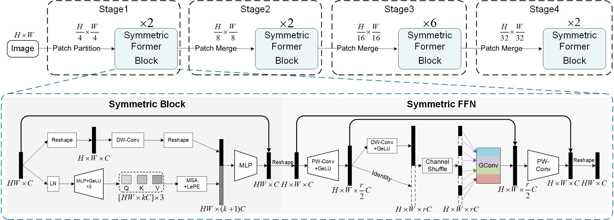

# Symmertic Former

By Shengjun Liang, Mingxin Yu*, Xiongxin Tang**, Xiaolin Liu, Lianqing Zhu.

This repo is the official implementation of "A Lightweight Vision Transformer with Symmetric Modules for Vision Tasks". It currently includes code and models for the following tasks:

> **Image Classification**: Included in this repo. See [get_started.md](classification/get_started.md) for a quick start.

> **Object Detection**: See [SF for Object Detection](detection).

> **Semantic Segmentation**: See [SF for Semantic Segmentation](sengmentation).

## Introduction

**Symmertic Former** (SF)



[//]: # (## Citing SFormer)

[//]: # (```)

[//]: # (@article{liu2021Swin,)

[//]: # (  title={SY: Hierarchical Vision Transformer using Shifted Windows},)

[//]: # (  author={Liu, Ze and Lin, Yutong and Cao, Yue and Hu, Han and Wei, Yixuan and Zhang, Zheng and Lin, Stephen and Guo, Baining},)

[//]: # (  journal={International Conference on Computer Vision &#40;ICCV&#41;},)

[//]: # (  year={2021})

[//]: # (})

[//]: # (```)
[//]: # (## Contributing)

[//]: # (This project welcomes contributions and suggestions.  Most contributions require you to agree to a)

[//]: # (Contributor License Agreement &#40;CLA&#41; declaring that you have the right to, and actually do, grant us)

[//]: # (the rights to use your contribution. For details, visit https://cla.opensource.microsoft.com.)

[//]: # ()
[//]: # (When you submit a pull request, a CLA bot will automatically determine whether you need to provide)

[//]: # (a CLA and decorate the PR appropriately &#40;e.g., status check, comment&#41;. Simply follow the instructions)

[//]: # (provided by the bot. You will only need to do this once across all repos using our CLA.)

[//]: # ()
[//]: # (This project has adopted the [Microsoft Open Source Code of Conduct]&#40;https://opensource.microsoft.com/codeofconduct/&#41;.)

[//]: # (For more information see the [Code of Conduct FAQ]&#40;https://opensource.microsoft.com/codeofconduct/faq/&#41; or)

[//]: # (contact [opencode@microsoft.com]&#40;mailto:opencode@microsoft.com&#41; with any additional questions or comments.)
